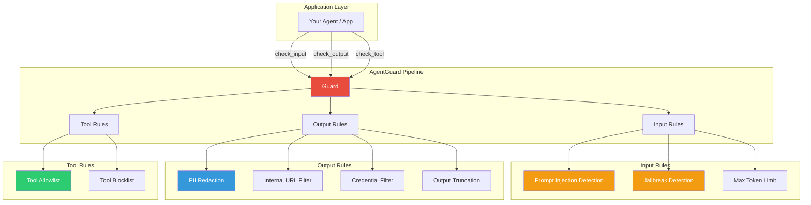
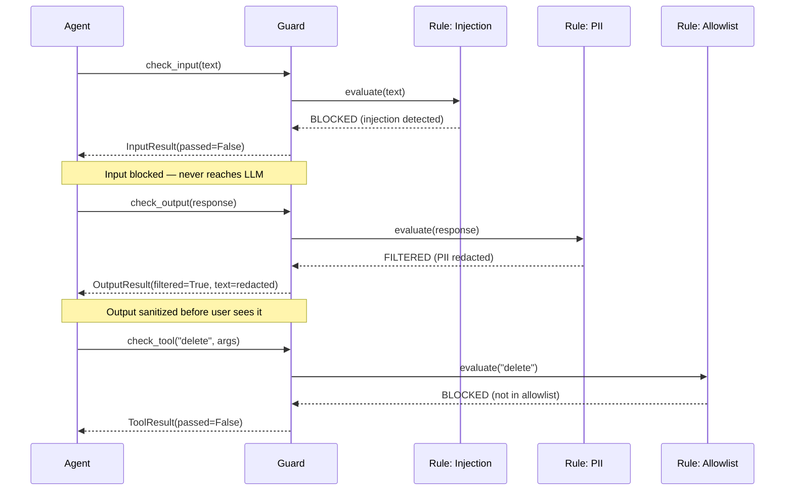
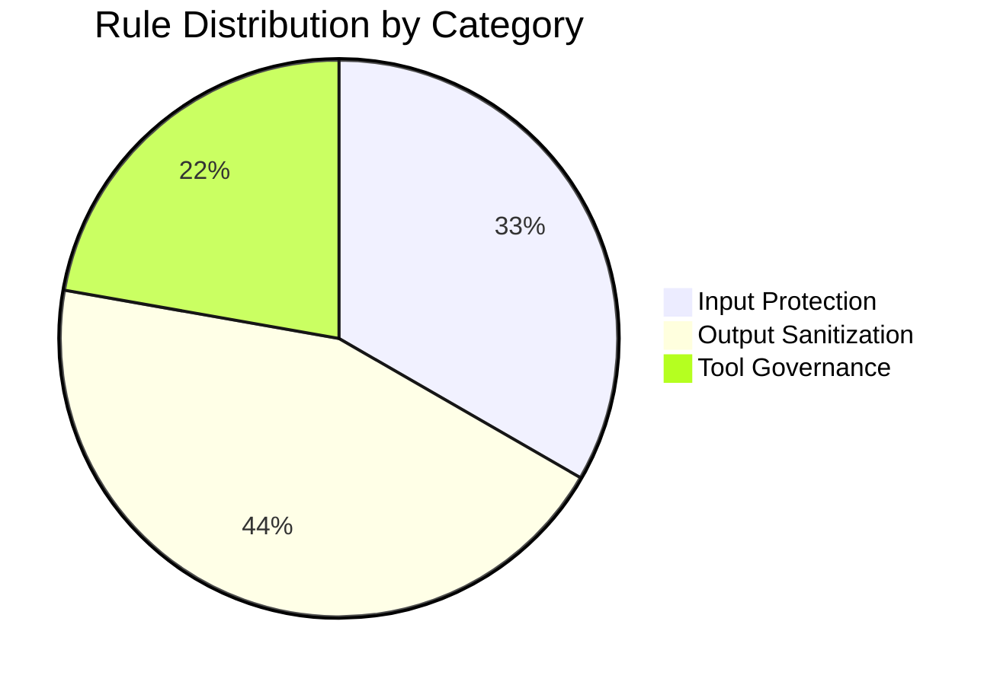

# AgentGuard Architecture

## Design Philosophy

AgentGuard implements a **pipeline-based guardrail system** where every LLM interaction passes through configurable rule chains. Rules are composable, stateless functions that can be mixed and matched per deployment.

## System Architecture



## Rule Execution Flow



## Rule Categories



## Threat Model

| Threat | Rule | Action | Confidence |
|--------|------|--------|------------|
| Prompt injection | `no_prompt_injection` | Block input | 95% (regex + pattern) |
| Jailbreak attempts | `no_jailbreak` | Block input | 90% (keyword match) |
| Token exhaustion | `max_input_tokens` | Block input | 100% (deterministic) |
| PII exposure | `no_pii_leakage` | Redact output | 85% (regex) |
| Internal URL leak | `no_internal_urls` | Redact output | 95% (domain match) |
| Credential leak | `no_credentials` | Redact output | 90% (pattern match) |
| Unauthorized tools | `tool_allowlist` | Block execution | 100% (deterministic) |
| Dangerous tools | `tool_blocklist` | Block execution | 100% (deterministic) |

## Integration Patterns

### Middleware Pattern (FastAPI)

```python
from agentguard import Guard, Rules

guard = Guard(rules=[
    Rules.no_prompt_injection(),
    Rules.no_pii_leakage(),
    Rules.tool_allowlist(["search", "get_order"]),
])

@app.post("/chat")
async def chat(request: ChatRequest):
    # Pre-LLM gate
    input_result = guard.check_input(request.message)
    if not input_result.passed:
        return {"error": f"Blocked: {input_result.reason}"}

    # LLM call
    response = await llm.generate(request.message)

    # Post-LLM filter
    output_result = guard.check_output(response)
    return {"response": output_result.text}
```

### LangChain Callback Pattern

```python
from agentguard import Guard, Rules

class GuardCallback(BaseCallbackHandler):
    def __init__(self):
        self.guard = Guard(rules=[Rules.no_prompt_injection()])

    def on_llm_start(self, prompts, **kwargs):
        for prompt in prompts:
            result = self.guard.check_input(prompt)
            if not result.passed:
                raise GuardError(result.reason)
```

## Performance Characteristics

| Operation | Latency | Notes |
|-----------|---------|-------|
| `check_input` (3 rules) | < 1ms | Regex-based, no ML |
| `check_output` (4 rules) | < 2ms | Regex + substitution |
| `check_tool` (allowlist) | < 0.1ms | Set lookup |
| Full pipeline (9 rules) | < 5ms | All rules combined |

Zero external dependencies. Zero network calls. Pure Python regex.
